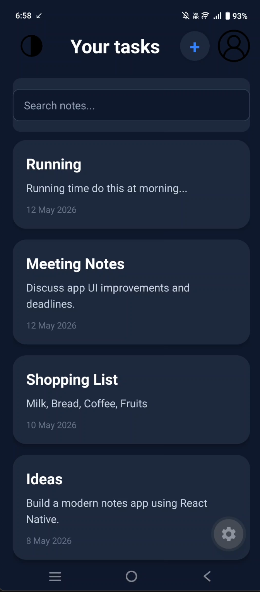
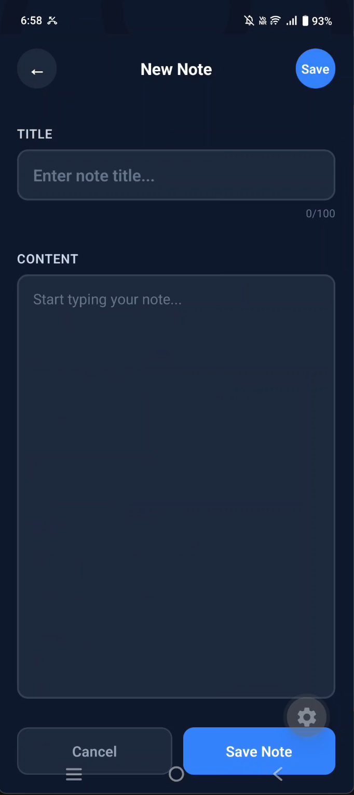
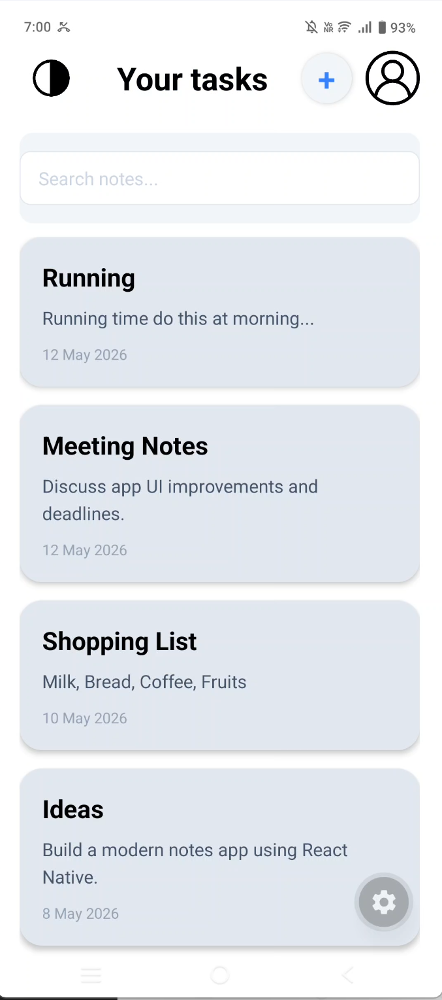
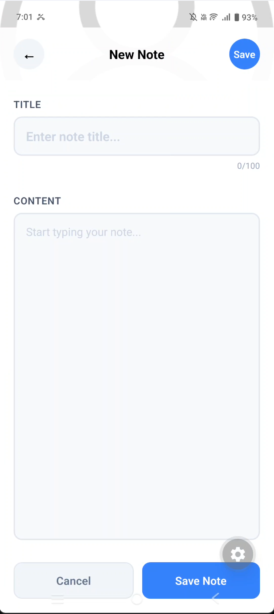

# 📝 Note App

A simple and modern React Native Notes App built using React Native and TypeScript. This app allows users to create, manage, and organize notes with a clean and responsive UI.

---

## 📱 Features

- ✨ Clean and minimal UI
- 📝 Create and manage notes
- 📋 Notes list with preview text
- 📅 Date display for notes
- ⚡ Fast and responsive performance
- 📱 Built with React Native + TypeScript
- 🎨 Modern mobile app design

---

```md id="b3g3q4"
## 🎥 Demo Video

[Download Demo Video](./assets/images/DemoOfNoteApp.mp4)

---

## 📸 Screenshots








```

---

## 🛠️ Tech Stack

- React Native
- TypeScript
- Expo / React Native CLI
- FlatList
- Pressable Components
- StyleSheet API

---

## 📂 Project Structure

```bash
Note-App/
│
├── assets/
├── components/
├── screens/
├── App.tsx
├── package.json
└── README.md
```

---

## 🚀 Getting Started

### 1️⃣ Clone the Repository

```bash
git clone https://github.com/AditSingh7/Note-App.git
```

### 2️⃣ Navigate to Project Folder

```bash
cd Note-App
```

### 3️⃣ Install Dependencies

```bash
npm install
```

---

## ▶️ Run the App

### Start Metro Server

```bash
npm start
```

### Run on Android

```bash
npm run android
```

### Run on iOS

```bash
npm run ios
```

---

## 📦 Dependencies

Example dependencies used in the project:

```json
{
  "react": "latest",
  "react-native": "latest",
  "typescript": "latest"
}
```

---

## 🎨 UI Preview

You can also add a GIF preview:

```md

```

---

## 📌 Future Improvements

- 🔍 Search notes
- 🗂️ Categories / Tags
- ☁️ Cloud Sync
- 🌙 Dark Mode
- ✏️ Edit existing notes
- 🗑️ Delete confirmation modal

---

## 🤝 Contributing

Contributions are welcome.

1. Fork the project
2. Create your feature branch
3. Commit your changes
4. Push to the branch
5. Open a Pull Request

---

## 📄 License

This project is licensed under the MIT License.

---

## 👨‍💻 Author

Made with ❤️ by Adit Singh

GitHub: [https://github.com/AditSingh7](https://github.com/AditSingh7)
